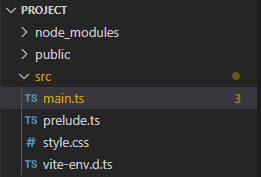

# Setup

## Öffnen des Projekts
1. Kopiere und entpacke die zur Verfügung gestellte Zip-Datei
2. Öffne den entpackten Ordner und führe `start.bat` mit einem Doppelklick aus
3. Nun sollten sich ein Konsolenfenster und ein Fenster des Programms `Visual Studio Code` (VsCode) (im Falle einer Warnung siehe [^1])
    - Das Konsolenfenster dient lediglich dem Anzeigen der Nachrichten des Webservers
    - Visual Studio Code wird verwendet, um den Quelltext der Simulation zu bearbeiten
4. Öffne anschließend die Datei `main.ts` in VsCode, falls diese nicht bereits geöffnet ist
    
5. Die Applikation lässt sich nun unter <http://127.0.0.1:5173> öffnen


## Grundstruktur des Programms
Der Inhalt von `main.ts` sollte wie folgt aussehen:
```typescript
// import des Layouts der Seite
import "./style.css";
// import von allen benötigten Funktionen
import { Vec2 } from "@david.harwardt/math";
import {
    Canvas2d, CanvasFullscreenPlugin, DrawLoop,
    CanvasDraggablePlugin, CanvasInputManagerPlugin,
} from "@david.harwardt/canvas-2d";

// Code zum erzeugen der Canvas
// ...
// ----------------------------

// Zeichenfunktion der Szene
function draw() {

}
```

---

[^1]Es besteht die Möglichkeit, dass ein Antivirenprogramm aufgrund einer Prozesserstellung oder dem gestarteten Webserver warnt, da, um die Entwicklung so einfach wie möglich zu gestalten,
einige Prozesse, u.a. ein temporärer, lokaler Webserver automatisch erzeugt werden.
Diese Warnung kann ignoriert werden oder alle benötigten Programme manuell installiert werden ([Anleitung manuelle installation](setup_manual.md)).
